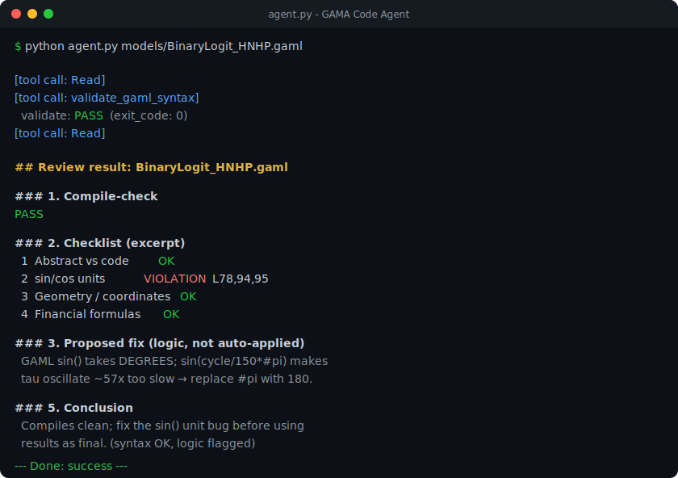

# GAMA Code Agent

An AI agent, powered by **Claude** (via the [Claude Agent SDK](https://docs.anthropic.com/en/api/agent-sdk/overview)),
that reviews, compile-checks, and (for syntax errors) auto-fixes
[GAMA](https://gama-platform.org/) **GAML** models — built for developers and
researchers who work with GAMA agent-based simulations.

It runs locally on your machine and talks to your own GAMA installation in
headless mode, so your models never leave your computer (only the code the agent
reads is sent to the Claude API for reasoning).

> 🇻🇳 Tiếng Việt: xem phần "Tóm tắt tiếng Việt" ở cuối README.

## Demo



*Illustrative example of the report format. The findings shown (a real
degrees-vs-radians `sin()` unit bug in a Binary-Logit traffic model) come from an
actual review run.*

## What it does

Given a `.gaml` file, the agent follows a fixed 4-step review process
(defined in [`.claude/skills/gama-code-reviewer/SKILL.md`](.claude/skills/gama-code-reviewer/SKILL.md)):

1. **Compile-check** the model with GAMA headless (no full simulation).
2. **Read the code** and compare it against a checklist of common GAML/ABM
   mistakes (unit bugs in `sin`/`cos`, geometry/CRS errors, financial-formula
   unit errors, parameter inconsistencies, instantaneous-vs-rolling-average
   charts, runtime-safety patterns, abstract-vs-code mismatches).
3. **Run** the main experiment in batch mode to catch runtime errors.
4. **Fix or propose:** it *auto-fixes syntax errors* (looping until it compiles,
   max 5 tries) but only *proposes* logic/data fixes for you to approve — because
   a logic error has no mechanical "correct" test and blind edits can produce
   results that look fine but are scientifically wrong.

It ends with a structured report you can compare across runs.

## Safety model

This agent can edit files, so it ships with hard guardrails (in `agent.py`,
enforced by a `can_use_tool` callback — not just by prompting):

| Guardrail | Purpose |
|---|---|
| Bash restricted to `git` only | Allows commit/diff/backup; blocks every other shell command |
| Write/Edit restricted to the model's own directory | The agent cannot touch files outside the folder of the `.gaml` you pass |
| `permission_mode="default"` | No "auto-approve everything" mode; risky actions go through the callback |
| Syntax vs. logic separation | Syntax errors auto-fixed & re-validated; logic errors are proposal-only |
| `max_turns=40` | Prevents runaway loops |

**Recommendation:** keep your GAML project under git and commit before running,
so you can `git diff` / `git checkout` anything the agent changed.

## Requirements

- **Python ≥ 3.10** (a standard CPython build — see the OS guides for a note on
  why MSYS/mingw Python does not work on Windows)
- **Node.js ≥ 20** (the Claude Agent SDK bundles the Claude Code CLI)
- A working **GAMA** installation with the `headless` launcher
- An **`ANTHROPIC_API_KEY`** ([get one here](https://console.anthropic.com/))

## Quickstart

Full, copy-pasteable instructions per OS:

- 🪟 **Windows** → [docs/SETUP_WINDOWS.md](docs/SETUP_WINDOWS.md)
- 🍎 **macOS** → [docs/SETUP_MACOS.md](docs/SETUP_MACOS.md)

Short version:

```bash
# 1. install
python -m venv .venv
#    Windows: .venv\Scripts\activate     macOS/Linux: source .venv/bin/activate
pip install -r requirements.txt

# 2. configure (copy .env.example -> .env and fill both values)
#    ANTHROPIC_API_KEY=sk-ant-...
#    GAMA_HEADLESS_DIR=<path to your GAMA .../headless folder>

# 3. run
python agent.py path/to/your/model.gaml
```

## Project structure

```
gama-code-agent/
├── agent.py                  # entry point — orchestration + safety guardrails
├── tools/
│   └── gama_tools.py         # MCP tools wrapping gama-headless (cross-platform)
├── .claude/
│   └── skills/
│       └── gama-code-reviewer/
│           └── SKILL.md      # the review process + checklist (edit to customize)
├── docs/
│   ├── SETUP_WINDOWS.md
│   └── SETUP_MACOS.md
├── requirements.txt
├── .env.example
└── LICENSE
```

## How it works (technical notes)

- The two GAMA tools are exposed to Claude as an **in-process MCP server**
  (`create_sdk_mcp_server`), so no separate process/port is needed.
- **Compile-checking uses `gama-headless -xml`, not `-validate`.** The `-validate`
  flag only validates GAMA's *built-in library*, not your file; `-xml` forces
  GAMA to compile *your* model (exit 0 + XML produced = PASS).
- On **Windows**, `gama-headless.bat` must be invoked by **absolute path** with
  the working directory set to the `headless` folder (otherwise it reports
  "not recognized"). On **macOS/Linux** the `.sh` is invoked via `bash`.
- The skill is loaded through `setting_sources=["project"]`, which reads
  `.claude/skills/` — that's why the skill lives under `.claude/`.

## Customizing

Edit [`.claude/skills/gama-code-reviewer/SKILL.md`](.claude/skills/gama-code-reviewer/SKILL.md)
to tailor the checklist to the kinds of models and bugs you deal with. You don't
need to touch the Python — the agent re-reads the skill on every run.

## License

MIT — see [LICENSE](LICENSE).

---

## Tóm tắt tiếng Việt

**GAMA Code Agent** là một AI agent dùng **Claude** để tự động review, kiểm tra
biên dịch và (với lỗi cú pháp) tự sửa model **GAML** của GAMA — dành cho lập
trình viên/nhà nghiên cứu dùng GAMA. Agent chạy cục bộ trên máy bạn và gọi tới
bản cài GAMA (headless) của chính bạn.

Cài nhanh:

1. Tạo venv + `pip install -r requirements.txt` (Python chuẩn ≥ 3.10, Node ≥ 20).
2. Copy `.env.example` → `.env`, điền `ANTHROPIC_API_KEY` và `GAMA_HEADLESS_DIR`
   (đường dẫn tới thư mục `headless` trong bản cài GAMA).
3. Chạy: `python agent.py path/to/model.gaml`

Hướng dẫn chi tiết theo hệ điều hành: [Windows](docs/SETUP_WINDOWS.md) ·
[macOS](docs/SETUP_MACOS.md). Cơ chế an toàn: Bash chỉ cho `git`, Edit chỉ trong
thư mục model, lỗi logic chỉ đề xuất chứ không tự sửa.
